# cfd-mesh: Architecture & Implementation Proposal

> **Status**: Active rewrite — replacing all internals while preserving the public API.
> Last updated: Phase 7 complete. Phases 1–7 done; 8–9 in backlog.

---

## Table of Contents

1. [Project Vision](#1-project-vision)
2. [Architecture Overview](#2-architecture-overview)
3. [Module Structure](#3-module-structure)
4. [Core Data Structures](#4-core-data-structures)
5. [Geometry Layer](#5-geometry-layer)
6. [Boolean Operations](#6-boolean-operations)
7. [Validation System](#7-validation-system)
8. [I/O Formats](#8-io-formats)
9. [Documentation Standards](#9-documentation-standards)
10. [Testing Strategy](#10-testing-strategy)
11. [Implementation Phases](#11-implementation-phases)
12. [Key Mathematical Theorems](#12-key-mathematical-theorems)
13. [Dependency Rationale](#13-dependency-rationale)

---

## 1. Project Vision

### Problem Statement

`cfd-mesh` serves as the geometry backbone for millifluidic CFD simulations in the
`cfdrs` workspace. The current implementation has three known weaknesses:

| Weakness | Impact |
|----------|--------|
| Two parallel mesh types (`Mesh<T>` and `IndexedMesh`) with no unified topology | Builders targeting `Mesh<T>` cannot directly use watertight validation |
| Custom GhostCell/PermissionedArena not yet wired into `Mesh<T>` or `IndexedMesh` | `permission/` (token.rs + cell.rs + arena.rs) is fully implemented but `IndexedMesh` still uses raw `Vec`-backed stores with no branded access control |
| BSP Boolean ops from `csgrs` use floating-point plane classification with `1e-5` tolerance | Degenerate inputs cause incorrect classification; no exact arithmetic |
| Vertex welding uses 27-cell spatial hash but snap grid (`snap.rs`) is independent | Two systems with different epsilon semantics can produce inconsistent vertex positions |
| No NURBS — boundaries are immediately tessellated flat triangles | CFD boundary accuracy limited by mesh resolution, not geometry precision |

### Target State

```text
┌──────────────────────────────────────────────────────────────────────┐
│  Single unified  Mesh<'id>  backed by GhostCell + SlotMap            │
│  ─────────────────────────────────────────────────────────────────── │
│  • Half-edge topology kernel (twin / next / prev invariants)         │
│  • Vertex positions deduplicated via 26-neighbor SnappingGrid        │
│  • Named CFD boundary patches (Inlet/Outlet/Wall/Symmetry/Periodic)  │
│  • NURBS curves + surfaces stored parametrically; tessellated lazily │
│  • Exact orient2d/3d predicates (Shewchuk) for all sign decisions    │
│  • Robust Boolean ops: BVH broad phase + exact intersection          │
│  • Full watertight validation: Euler, manifold, winding, patches     │
│  • All public items: rustdoc + mermaid diagrams + theorems           │
└──────────────────────────────────────────────────────────────────────┘
```

---

## 2. Architecture Overview

```
                       ┌──────────────────────────────────┐
                       │          cfd-mesh crate           │
                       │                                  │
  CAD / NURBS input    │  ┌────────────┐  ┌────────────┐  │
  ─────────────────►   │  │  geometry  │  │ permission │  │
                       │  │  (NURBS,   │  │ (GhostCell │  │
  STL / JSON input     │  │ predicates,│  │ + SlotMap) │  │
  ─────────────────►   │  │  builders) │  └─────┬──────┘  │
                       │  └─────┬──────┘        │         │
                       │        │         ┌─────▼──────┐  │
                       │        └────────►│  Mesh<'id> │  │
                       │                 │  (half-edge │  │
                       │  ┌──────────┐   │  topology) │  │
                       │  │ welding  │──►│            │  │
                       │  │(snapping │   └─────┬──────┘  │
                       │  │  grid)   │         │         │
                       │  └──────────┘   ┌─────▼──────┐  │
                       │                 │ watertight  │  │
                       │  ┌──────────┐   │ validation  │  │
                       │  │   csg    │◄──│ (manifold,  │  │
                       │  │(Boolean  │   │  Euler,     │  │
                       │  │   ops)   │   │  winding)   │  │
                       │  └──────────┘   └─────┬──────┘  │
                       │                       │         │
                       │  ┌──────────────────── ▼──────┐  │
                       │  │          io                 │  │
                       │  │  STL  │  VTK  │  OpenFOAM  │  │
                       │  └─────────────────────────────┘  │
                       └──────────────────────────────────┘
```

### Mermaid (rendered in rustdoc via `aquamarine`)

```mermaid
graph TB
    subgraph perm["permission (GhostCell + SlotMap)"]
        GT["GhostToken&lt;'id&gt;"]
        GC["GhostCell&lt;'id, T&gt;"]
        SM["SlotMap keys\nVertexKey / HalfEdgeKey / FaceKey"]
    end

    subgraph geo["geometry"]
        NURBS["NURBS curves/surfaces"]
        Pred["Exact predicates\norient2d / orient3d"]
        Snap["SnappingGrid\n26-neighbor"]
        Builders["VenturiMeshBuilder\nSerpentineMeshBuilder\netc."]
    end

    subgraph mesh["Mesh&lt;'id&gt; (half-edge)"]
        HE["HalfEdgeData\ntwin / next / prev"]
        VD["VertexData\nposition + half_edge"]
        FD["FaceData\nhalf_edge + patch + normal"]
        PD["BoundaryPatch\nInlet/Outlet/Wall/..."]
    end

    subgraph valid["watertight / quality"]
        Euler["Euler–Poincaré\nV-E+F=2"]
        Mani["Manifold check"]
        Wind["Winding consistency"]
        Patch["Patch completeness"]
    end

    subgraph csg_mod["csg (feature = csg)"]
        BVH["BVH broad phase"]
        IX["Exact triangle\nintersection"]
        Clip["S-H clipping"]
        Recon["Reconstruction"]
    end

    perm --> mesh
    geo --> mesh
    mesh --> valid
    mesh --> csg_mod
    mesh --> io
```



---

## 3. Module Structure

```
src/
  lib.rs                     re-exports; crate-level mermaid; feature gates
  mesh.rs                    Mesh<'id>, with_mesh(), IndexedMesh snapshot, MeshBuilder
  core/
    scalar.rs                Real (f64/f32), TOLERANCE, sanitize helpers     [KEEP]
    index.rs                 slotmap new_key_type!: VertexKey, HalfEdgeKey,  [REPLACE]
                             FaceKey, PatchKey + legacy VertexId aliases
    error.rs                 MeshError (extend with topological variants)     [EXTEND]
    constants.rs             physical constants (MM, UM, channel defaults)    [KEEP]
  permission/
    mod.rs                   re-exports                                       [KEEP]
    token.rs                 GhostToken<'brand> — invariant lifetime brand    [KEEP — already implemented]
    cell.rs                  GhostCell<'brand, T> — UnsafeCell + token gate   [KEEP — already implemented]
    arena.rs                 PermissionedArena: extend Vec→SlotMap backing    [EXTEND]
  topology/
    mod.rs                   re-exports + ElementType, legacy Vertex/Face/Cell[EXTEND]
    halfedge.rs              HalfEdgeData, VertexData, FaceData               [NEW]
    patch.rs                 BoundaryPatch, PatchType                         [NEW]
    adjacency.rs             AdjacencyGraph (keep for FEM compat)             [KEEP]
    manifold.rs              ManifoldReport using half-edge traversal          [REPLACE]
    orientation.rs           winding check using exact predicates              [EXTEND]
    connectivity.rs          connected_components                              [KEEP]
  storage/
    mod.rs
    pool.rs                  SlotMap<K, GhostCell<'id, V>> wrapper            [REPLACE]
    vertex_pool.rs           VertexPool using SnappingGrid + new keys          [REPLACE]
    face_store.rs            FaceStore with SlotMap + GhostCell                [REPLACE]
    edge_store.rs            EdgeStore with HalfEdge SlotMap                   [REPLACE]
    attribute.rs             AttributeStore<K> (keep)                          [KEEP]
  geometry/
    mod.rs
    plane.rs                 Plane (Hessian normal form)                       [KEEP]
    aabb.rs                  Aabb + BVH compat trait impls                     [EXTEND]
    normal.rs                triangle/newell normals                           [KEEP]
    measure.rs               area, signed volume                               [KEEP]
    distance.rs              closest point, ray-triangle                       [KEEP]
    predicates.rs            exact orient_2d, orient_3d, incircle, insphere    [NEW]
    nurbs/
      mod.rs
      knot.rs                KnotVector (de Boor recursion basis)              [NEW]
      curve.rs               BSplineCurve<D>, NurbsCurve<D>                    [NEW]
      surface.rs             BSplineSurface, NurbsSurface                      [NEW]
      tessellate.rs          curvature-adaptive sampling                        [NEW]
    venturi.rs               VenturiMeshBuilder → new Mesh<'id> API            [PORT]
    serpentine.rs            SerpentineMeshBuilder → new Mesh<'id> API         [PORT]
    branching.rs             BranchingMeshBuilder → new Mesh<'id> API          [PORT]
  welding/
    mod.rs
    snap.rs                  SnappingGrid (26-neighbor, replaces two systems)  [REPLACE]
    spatial_hash.rs          SpatialHashGrid (keep for welding radius queries) [KEEP]
    welder.rs                MeshWelder → uses SnappingGrid                    [REPLACE]
  watertight/
    mod.rs
    check.rs                 WatertightReport + Euler characteristic            [EXTEND]
    repair.rs                MeshRepair (fix orientation, remove degenerate)    [KEEP]
    seal.rs                  seal_boundary_loops                                [KEEP]
  quality/
    mod.rs
    metrics.rs               QualityMetric                                      [KEEP]
    triangle.rs              aspect_ratio, skewness, edge_ratio                 [KEEP]
    validation.rs            MeshValidator using half-edge topology             [EXTEND]
  channel/                   all kept; sweep.rs ported to new API              [PORT]
  hierarchy/                 all kept; ported to new API                        [PORT]
  grid.rs                    StructuredGridBuilder → new API                   [PORT]
  csg/
    mod.rs                   BooleanOp, CsgError (compat), CsgTree             [REPLACE]
    bsp.rs                   exact-predicate BSP (replaces csgrs port)          [REPLACE]
    broad_phase.rs           BVH wrapper (bvh crate, f32 AABB + f64 narrow)    [NEW]
    intersect.rs             exact triangle-triangle intersection                [NEW]
    clip.rs                  Sutherland-Hodgman polygon clipping                 [NEW]
    reconstruct.rs           fragment → watertight mesh reconstruction           [NEW]
    classify.rs              inside/outside with exact orient_3d                 [REPLACE]
    split.rs                 triangle splitting (uses new predicates)            [REPLACE]
    boolean.rs               full pipeline: broad→intersect→clip→reconstruct    [REPLACE]
  io/
    mod.rs
    stl.rs                   STL r/w + fuzz target entry point                  [EXTEND]
    vtk.rs                   VTK ASCII (keep)                                   [KEEP]
    scheme.rs                cfd-schematics import (keep)                       [KEEP]
  bin/
    inspect_stl.rs           CLI inspector (keep)                               [KEEP]
```

---

## 4. Core Data Structures

### 4.1 GhostCell Brand System

The brand `'id` is an invariant lifetime that ties:
- One `GhostToken<'id>` — the single permission key for the entire mesh
- Many `GhostCell<'id, T>` — data wrappers; reading requires `&token`, writing requires `&mut token`

```text
                    ┌─ GhostToken<'id> ─┐
                    │  (unique at any   │
                    │   instant)        │
                    └──────┬────────────┘
                           │  borrow(&token)     → &T   (shared, aliasable)
                           │  borrow_mut(&mut t) → &mut T  (exclusive)
                           ▼
  SlotMap<VertexKey, GhostCell<'id, VertexData>>
  ├── key=v0  │  GhostCell { pos: (0,0,0), half_edge: he3 }
  ├── key=v1  │  GhostCell { pos: (1,0,0), half_edge: he0 }
  └── key=v2  │  GhostCell { pos: (0,1,0), half_edge: he1 }
```

**Zero runtime cost**: no `RefCell`, no `Mutex`, no reference counting. All safety at compile time.

### 4.2 Half-Edge Mesh Layout

Every undirected edge is stored as two directed half-edges. For two triangles △ABC and △CBD:

```text
         A
        / \
       /   \
     he0   he2
     /  △ABC \
    B──────────C
    │  △CBD  │
     \       /
     he3   he5
       \   /
         D

he0: B→A, face=△ABC, twin=he_ab_rev, next=he2
he1: A→C, face=△ABC, twin=he_ca_rev, next=he0  ← wait: standard: next goes CCW
he2: C→B, face=△ABC, twin=he3,       next=he1
he3: B→C, face=△CBD, twin=he2,       next=he5
he4: C→D, face=△CBD, twin=he_dc_rev, next=he3
he5: D→B, face=△CBD, twin=he_db_rev, next=he4

Key invariants:
  twin(twin(he)) == he          [involution]
  next(prev(he)) == he          [consistency]
  face(next(he)) == face(he)    [face loop closure]
```

### 4.3 Type Definitions

```rust
// core/index.rs — replaces raw u32 newtypes with SlotMap keys
use slotmap::new_key_type;
new_key_type! { pub struct VertexKey; }
new_key_type! { pub struct HalfEdgeKey; }
new_key_type! { pub struct FaceKey; }
new_key_type! { pub struct PatchKey; }

// Legacy aliases for downstream compat:
pub type VertexId = VertexKey;
pub type FaceId   = FaceKey;
```

```rust
// topology/halfedge.rs
pub struct HalfEdgeData {
    pub vertex: VertexKey,       // tip/head vertex
    pub face:   Option<FaceKey>, // None = boundary sentinel
    pub twin:   HalfEdgeKey,
    pub next:   HalfEdgeKey,
    pub prev:   HalfEdgeKey,
}

pub struct VertexData {
    pub position:  nalgebra::Point3<Real>,
    pub half_edge: HalfEdgeKey,  // any outgoing half-edge
}

pub struct FaceData {
    pub half_edge: HalfEdgeKey,      // any bounding half-edge
    pub patch:     Option<PatchKey>,
    pub normal:    nalgebra::UnitVector3<Real>,
}
```

### 4.4 `Mesh<T>` (existing) and `Mesh<'id>` (target)

The crate already exposes `Mesh<T: Copy + RealField>` — a generic FEM/FVM mesh
parameterised on the scalar type. This generic design is deliberately preserved
through the rewrite: all public geometry builders and FEM consumers that use
`Mesh<f64>` or `Mesh<f32>` continue to work unchanged.

The `'id`-branded variant below is an *additional* surface mesh type that layers
GhostCell safety on top of the existing generic foundation:

```rust
// mesh.rs — already present, generic over scalar T
pub struct Mesh<T: Copy + nalgebra::RealField> { /* vertices, faces, cells */ }

// mesh.rs — new branded half-edge surface mesh
pub struct Mesh<'id> {
    vertices:   SlotMap<VertexKey,   GhostCell<'id, VertexData>>,
    half_edges: SlotMap<HalfEdgeKey, GhostCell<'id, HalfEdgeData>>,
    faces:      SlotMap<FaceKey,     GhostCell<'id, FaceData>>,
    patches:    SlotMap<PatchKey,    BoundaryPatch>,
}

/// Canonical entry point — introduces the GhostCell brand `'id`.
/// The token cannot escape the closure; return value R carries extracted data.
pub fn with_mesh<F, R>(f: F) -> R
where
    F: for<'id> FnOnce(Mesh<'id>, GhostToken<'id>) -> R,
{
    GhostToken::new(|token| f(Mesh::new(), token))
}
```

`IndexedMesh` (kept as public export) becomes a serializable snapshot:
```rust
pub struct IndexedMesh {
    pub positions: Vec<[Real; 3]>,
    pub indices:   Vec<[u32; 3]>,   // triangle index triples
    pub patches:   Vec<BoundaryPatch>,
}
impl IndexedMesh {
    // Extract from live Mesh<'id>
    pub fn from_mesh<'id>(mesh: &Mesh<'id>, token: &GhostToken<'id>) -> Self { ... }
}
```

### 4.5 SnappingGrid — Unified Vertex Welding

Replaces the current two-system split (`snap.rs` + `spatial_hash.rs`):

```text
SnappingGrid { epsilon, map: HashMap<(i64,i64,i64), VertexKey> }

insert(pos: Point3r, mesh: &mut Mesh, token: &mut GhostToken) -> VertexKey:
  key = (round(pos.x/ε), round(pos.y/ε), round(pos.z/ε))
  for each of 26 neighbors of key:
    if map contains neighbor_key:
      candidate = mesh.vertex_pos(map[neighbor_key])
      if |candidate - pos| < ε: return map[neighbor_key]  ← reuse
  new_key = mesh.add_vertex(pos, token)
  map.insert(key, new_key)
  return new_key
```

**Theorem (welding idempotency)**: `insert(insert(p)) == insert(p)`.
*Proof*: Second call finds the key from the first call in the 26-neighbor check and returns it unchanged. ∎

---

## 5. Geometry Layer

### 5.1 Exact Predicates (`geometry/predicates.rs`)

Wraps the `geometry-predicates` crate (Shewchuk adaptive arithmetic):

```rust
pub enum Orientation { Positive, Negative, Zero }

/// Exact 3D orientation test.
///
/// # Theorem (Shewchuk, 1997)
/// Returns the exact sign of:
///   |ax-dx  ay-dy  az-dz|
///   |bx-dx  by-dy  bz-dz|
///   |cx-dx  cy-dy  cz-dz|
/// using adaptive precision — result is never wrong due to FP cancellation.
pub fn orient_3d(a: Point3r, b: Point3r, c: Point3r, d: Point3r) -> Orientation
```

### 5.2 NURBS (`geometry/nurbs/`)

B-spline basis via Cox–de Boor recursion:

```
N_{i,0}(t) = 1  if t_i ≤ t < t_{i+1}, else 0
N_{i,p}(t) = (t-t_i)/(t_{i+p}-t_i) · N_{i,p-1}(t)
           + (t_{i+p+1}-t)/(t_{i+p+1}-t_{i+1}) · N_{i+1,p-1}(t)

NURBS curve:
  C(t) = Σ N_{i,p}(t)·w_i·P_i / Σ N_{i,p}(t)·w_i
```

**Theorem (partition of unity)**: `Σ_i N_{i,p}(t) = 1` for all t. Ensures curve lies in the
convex hull of its control points — critical for AABB computation.

Adaptive tessellation: subdivide parameter intervals until the angle between endpoint
tangents is below `max_angle_deviation` (default 5°). Uses recursive bisection.

### 5.3 Curvature-Adaptive Surface Tessellation

```text
Input: NurbsSurface, TessellationConfig { max_angle_deg, min_segments }

1. Start with coarse 4×4 parameter grid
2. For each quad cell:
   a. Evaluate normals at 4 corners
   b. max_angle = max angle between any pair of corner normals
   c. If max_angle > config.max_angle_deg → bisect cell (in u if wider, else v)
   d. Recurse on sub-cells
3. Collect leaf quads → triangulate (2 triangles each)
4. Weld boundary vertices via SnappingGrid
5. Return as IndexedMesh with UV stored as vertex attributes
```

---

## 6. Boolean Operations

### 6.1 Pipeline

```text
Input: two validated Mesh<'id> objects A, B

Step 1  BVH broad phase
        Build f32 BVH over triangles of A, over triangles of B.
        Dual-BVH traversal → candidate pairs (f_A, f_B) with overlapping AABBs.
        ┌──────────────────────────────────────────────────────────┐
        │  f32 BVH for fast spatial culling                       │
        │  f64 exact predicates for narrow-phase correctness      │
        └──────────────────────────────────────────────────────────┘

Step 2  Exact triangle-triangle intersection
        For each candidate pair: use orient_3d to confirm actual intersection.
        Compute intersection line segment (plane-plane-plane).
        All sign decisions exact.

Step 3  Retriangulation
        Insert intersection edges into both A and B.
        For each affected face: project to local 2D frame,
        re-triangulate with spade CDT.

Step 4  Classification
        For each fragment face of A: ray-cast against B, count crossings.
        Even = outside B, odd = inside B. Exact ray-triangle test.

Step 5  Selection (Boolean rule)
        Union:        outside_A ∪ outside_B
        Intersection: inside_A  ∩ inside_B
        Difference:   outside_B from A  ∪  inside_A from B (flipped)

Step 6  Reconstruction
        Merge fragments, weld coincident vertices (SnappingGrid),
        validate watertightness, inherit patch labels.
```

### 6.2 CSG Tree

```rust
pub enum CsgNode {
    Leaf(MeshHandle),
    Union        { left: Box<CsgNode>, right: Box<CsgNode> },
    Intersection { left: Box<CsgNode>, right: Box<CsgNode> },
    Difference   { left: Box<CsgNode>, right: Box<CsgNode> },
    Transform    { node: Box<CsgNode>, iso: nalgebra::Isometry3<Real> },
}
```

**Theorem (Boolean volume identity)**:
`volume(A) + volume(B) = volume(A ∪ B) + volume(A ∩ B)`.
Used as a round-trip test oracle in integration tests.

---

## 7. Validation System

### 7.1 Invariants Checked

| Category | Check | Level |
|----------|-------|-------|
| Topological | `twin(twin(he)) == he` | Quick |
| | `next(prev(he)) == he` | Quick |
| | Face loops terminate | Quick |
| | Vertex rings terminate | Quick |
| | All referenced keys valid | Quick |
| Manifold | Interior edges have exactly 2 faces | Full |
| | Boundary edges have exactly 1 face | Full |
| | Vertex fan is a topological disk | Full |
| Watertight | No open boundary edges (interior domain) | Full |
| | Euler: `V - E + F = 2` (genus-0 closed mesh) | Full |
| Winding | All normals consistently outward | Full |
| | `orient_3d(centroid + ε·normal, interior_pt) > 0` | Full |
| CFD Patches | Every boundary face assigned to a patch | Paranoid |
| | No interior face assigned to a patch | Paranoid |
| | Periodic patches come in matched pairs | Paranoid |
| Geometric | No degenerate faces (area > ε²) | Paranoid |
| | No near-duplicate vertices (> ε apart) | Paranoid |

### 7.2 Euler–Poincaré Theorem

```
Theorem: For a closed orientable triangulated 2-manifold of genus g:
    V - E + F = 2(1 - g)

Corollary (CFD requirement): For a genus-0 domain boundary:
    V - E + F = 2

Proof sketch: By induction on F. Adding a triangle across an existing
boundary edge: ΔF=+1, ΔE=+2, ΔV=+1 (new vertex) or ΔE=+1, ΔV=0
(closing a quad), net change to V-E+F is always 0. Base case F=1:
V-E+F = 3-3+1 = 1. Closing the mesh adds the last face that creates
no new vertices or edges: ΔV=0, ΔE=0, ΔF=+1, reaching V-E+F=2. ∎

Implementation in watertight/check.rs:
    E = Σ_faces |face_loop| / 2   (each edge counted by 2 half-edges)
    assert!(vertices - edges + faces == 2)
```

---

## 8. I/O Formats

| Format | Direction | Notes |
|--------|-----------|-------|
| STL ASCII | read + write | vertex welding on read |
| STL binary | read + write | preferred for large meshes |
| VTK legacy ASCII | write | VTK_TRIANGLE cells |
| OpenFOAM polyMesh | write | maps `PatchType` → OF patch type strings |
| cfd-schematics JSON | read | feature `scheme-io` |

OpenFOAM patch type mapping:
```
PatchType::Inlet    → "patch"    (physicalType: inlet)
PatchType::Outlet   → "patch"    (physicalType: outlet)
PatchType::Wall     → "wall"
PatchType::Symmetry → "symmetry"
PatchType::Periodic → "cyclicAMI"
```

---

## 9. Documentation Standards

Every `pub` item must have:

1. **One-sentence summary** (rustdoc first line)
2. **`# Invariants`** section for types and mutation methods
3. **`# Examples`** block with working code
4. **Mermaid diagram** via `aquamarine` for types with non-trivial relationships
5. **ASCII art** for data layouts and algorithm flows
6. **`# Theorem`** + **`**Proof sketch**`** for geometric/topological functions

Example:

```rust
/// Represents a half-edge in the mesh topology.
///
/// # Invariants
///
/// - `twin(twin(he)) == he` (involution)
/// - `next(prev(he)) == he` (consistency)
/// - `face(next(he)) == face(he)` (face loop closure)
///
/// # Diagram
///
/// ```text
///   ──►  he  ──►  next(he)  ──►  ...  ──►  he  (loop closes)
///        │
///       twin
///        │
///   ◄──  twin(he)  ◄──  ...
/// ```
///
/// # Theorem: Twin Involution
/// `twin ∘ twin = id` on half-edges.
/// **Proof**: Each undirected edge stores exactly two half-edges
/// pointing at each other as twins by construction. ∎
pub struct HalfEdgeData { ... }
```

---

## 10. Testing Strategy

| Layer | Tool | What |
|-------|------|------|
| Unit (inline) | `#[test]` | Each data structure + predicate |
| Integration (`tests/`) | nextest | Mesh build → validate → I/O round-trip |
| Property-based | `proptest` | Random meshes → invariants; welding idempotency; Boolean volume identity |
| Debug invariants | `#[cfg(debug_assertions)]` | `twin(twin(he))==he`, `next(prev(he))==he` after every mutation |
| Fuzzing | `cargo-fuzz` | STL + OBJ parsers never panic |
| Regression | fixture meshes | Cube, sphere, torus, Venturi, channel; exact volumes checked |

### Key proptest properties

```rust
// Welding idempotency
proptest! {
    fn snap_idempotent(x in -1e3_f64..1e3, y in -1e3..1e3, z in -1e3..1e3) {
        let p = Point3::new(x, y, z);
        let k1 = grid.insert(p, &mut mesh, &mut token);
        let k2 = grid.insert(p, &mut mesh, &mut token);
        prop_assert_eq!(k1, k2);
    }
}

// Twin involution
proptest! {
    fn twin_involution(mesh in arb_triangle_mesh()) {
        for he in mesh.half_edges() {
            prop_assert_eq!(mesh.twin(mesh.twin(he)), he);
        }
    }
}

// Boolean volume identity
proptest! {
    fn boolean_volume_identity(a in arb_box(), b in arb_box()) {
        let vol_a = a.signed_volume();
        let vol_b = b.signed_volume();
        let union  = csg_boolean(BooleanOp::Union, a, b);
        let inter  = csg_boolean(BooleanOp::Intersection, a, b);
        let sum = union.signed_volume() + inter.signed_volume();
        prop_assert!((sum - (vol_a + vol_b)).abs() < 1e-6);
    }
}
```

---

## 11. Implementation Phases

| Phase | Status | Key Files | Goal |
|-------|--------|-----------|------|
| **1** Foundation | ✅ DONE | `Cargo.toml`, `core/index.rs`, `permission/arena.rs`, `mesh.rs` | `Mesh<'id>`, `with_mesh()` — builds on existing `GhostToken`/`GhostCell` in `permission/`; extend `PermissionedArena` to SlotMap backing; generic `Mesh<T>` kept as-is |
| **2** Geometry | ✅ DONE | `geometry/predicates.rs`, `welding/snap.rs` | Exact predicates; unified 26-neighbor SnappingGrid |
| **3** Topology | ✅ DONE | `topology/halfedge.rs`, `storage/` (pool, vertex_pool, face_store, edge_store) | Full half-edge CRUD + traversal iterators |
| **4** Validation | ✅ DONE | `topology/manifold.rs`, `watertight/check.rs`, `quality/validation.rs` | Manifold + Euler + winding + patch checks; `WatertightReport` |
| **5** NURBS | ✅ DONE | `geometry/nurbs/` | KnotVector, BSplineCurve, NurbsSurface, adaptive tessellation |
| **6** Builders | ✅ DONE | `geometry/venturi.rs`, `serpentine.rs`, `branching.rs` | Added `build_surface() → IndexedMesh` to all three builders; deprecated legacy `build() → Mesh<T>`; cleaned warnings; removed dead `welding/snapping_grid.rs`; replaced `#![allow(unused)]` with `#![allow(dead_code)]` in lib.rs |
| **7** I/O | ✅ DONE | `io/stl.rs`, `io/vtk.rs` | `read_binary_stl` low-level reader; `read_stl`/`write_stl_ascii`/`write_stl_binary` high-level IndexedMesh helpers; `read_stl_he`/`write_stl_ascii_he`/`write_stl_binary_he` for HalfEdgeMesh; `fuzz_read_stl` entry point; `write_vtk_indexed`/`write_vtk_he`; cargo-fuzz harness in `fuzz/` with targets `fuzz_read_stl` + `fuzz_read_stl_he`; 6 new unit tests (round-trip ASCII, binary, half-edge, fuzz smoke tests); 83 tests pass |
| **8** Boolean | ✅ DONE | `csg/broad_phase.rs`, `csg/intersect.rs`, `csg/clip.rs`, `csg/reconstruct.rs`, `csg/boolean.rs`, `csg/mod.rs`, `csg/classify.rs` | Exact Boolean ops: AABB broad phase in `broad_phase.rs`; Möller-Trumbore + Shewchuk `orient_3d` exact T-T intersection in `intersect.rs`; Sutherland-Hodgman polygon clipping with exact predicates in `clip.rs`; fragment reconstruction with vertex welding in `reconstruct.rs`; `CsgNode` expression tree + `csg_boolean_indexed()` IndexedMesh API + `transform_mesh()` in `boolean.rs`; `classify_triangle_exact()` (no epsilon) in `classify.rs`; 107 tests pass |
| **9** Docs | 🔲 TODO | `lib.rs` + all modules | Rustdoc + aquamarine + theorems + examples; remove `#![allow(missing_docs)]` + `#![allow(dead_code)]` |

---

## 12. Key Mathematical Theorems

| Module | Theorem |
|--------|---------|
| `topology/halfedge.rs` | **Twin involution**: `twin ∘ twin = id` |
| `watertight/check.rs` | **Euler–Poincaré**: `V - E + F = 2(1-g)` |
| `topology/manifold.rs` | **2-Manifold condition**: 1 or 2 faces per edge + vertex fans are disks |
| `geometry/predicates.rs` | **Shewchuk**: exact sign of 3×3 determinant despite floating-point |
| `geometry/nurbs/curve.rs` | **Partition of unity**: `Σ N_{i,p}(t) = 1` + local support |
| `csg/boolean.rs` | **Volume identity**: `vol(A) + vol(B) = vol(A∪B) + vol(A∩B)` |
| `welding/snap.rs` | **Idempotency**: `snap(snap(p)) = snap(p)` |

---

## 13. Dependency Rationale

| Crate | Added/Existing | Purpose |
|-------|---------------|---------|
| `ghost-cell` | **REMOVE** | Our `permission/` crate (token.rs + cell.rs) is a fully correct, zero-cost custom implementation with identical semantics. Owning the implementation avoids an external dependency and lets us extend the API (e.g. multi-token meshes) without waiting on upstream. Remove from `Cargo.toml`; keep `permission/` as the canonical source. |
| `slotmap` | **already in Cargo.toml** | Stable generational keys replacing raw u32 newtypes; O(1) insert/delete — `VertexKey`, `HalfEdgeKey`, `FaceKey`, `PatchKey`, `RegionKey` already defined in `core/index.rs` |
| `geometry-predicates` | **NEW** | Shewchuk exact orient2d/3d, incircle, insphere — foundation of robust Boolean ops |
| `rstar` | **NEW** | R*-tree for dynamic spatial range queries (Boolean broad phase) |
| `kiddo` | **NEW** | k-d tree for nearest-neighbor vertex queries (validation) |
| `bvh` | **NEW** | BVH with SAH for Boolean broad phase triangle pair culling |
| `spade` | **NEW** | 2D constrained Delaunay triangulation for face re-triangulation after intersection |
| `aquamarine` | **NEW** | Mermaid diagrams in rustdoc |
| `nalgebra` | existing | Linear algebra, vectors, matrices |
| `hashbrown` | existing | Fast hash map for SnappingGrid (keep `0.15` pin for millifluidic tolerances) |
| `geometry-predicates` vs `robust` | prefer `geometry-predicates` | Full suite (orient2d/3d + incircle + insphere) in pure Rust |

---

*This document is the architecture reference for the `cfd-mesh` rewrite. Implementation
follows the phases in §11. All new code must satisfy the documentation standards in §9
and include tests per §10 before merge.*
