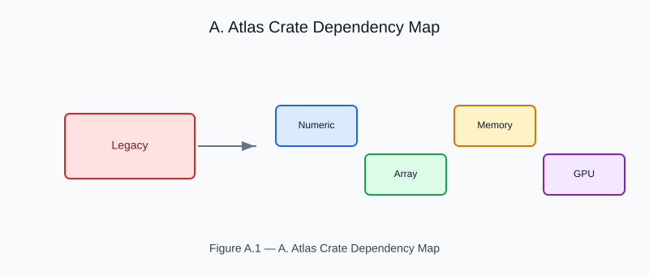

# Appendix A — Atlas Crate Dependency Map

<!-- generated-figure-start -->

*Figure A.1 — A. Atlas Crate Dependency Map*
<!-- generated-figure-end -->

A CFDrs-centric view of the Atlas stack — which crate owns which surface
and which CFDrs crate consumes it.

## Crate Map

| Atlas crate | Surface | CFDrs consumer |
|---|---|---|
| `eunomia` | `RealField`, `ComplexField`, `FloatElement`, `IntElement` | every CFDrs crate |
| `leto` | `NdArray<T,D>`, `CowArray`, geometry types | `cfd-math`, `cfd-1d`, `cfd-2d`, `cfd-3d`, `cfd-schematics` |
| `leto` GAT | `LendingIterator`, `TileStreaming` | `cfd-2d::stencil`, `cfd-3d::stencil` |
| `leto-ops` | dense/sparse linear algebra, Krylov solvers, sparse LU | `cfd-math` |
| `hermes-simd` | `SimdLane`, vectorized kernels | `cfd-2d::stencil`, `cfd-3d::fem`, `cfd-1d::kernel` |
| `mnemosyne` | `Arena`, `ScratchArena` | every CFDrs crate |
| `themis` | `Placement`, NUMA bindings | `cfd-3d`, `cfd-2d` |
| `moirai` | `Executor`, `TaskGraph`, channels | `cfd-2d::parallel`, `cfd-3d::parallel`, `cfd-optim` |
| `apollo` | `FftPlan` | `cfd-3d::spectral`, `cfd-2d::spectral` |
| `aequitas` | dimensioned quantities for public physical contracts | `cfd-core`, `cfd-1d`, `cfd-2d`, `cfd-3d`, `cfd-validation` |
| `hephaestus` | `Backend`, GPU kernels | opt-in via the `cfd-3d` GPU feature |
| `coeus` | `Tensor`, autodiff | not consumed — CFDrs runs no autodiff |
| `ritk` | image I/O | not consumed — CFDrs holds no image data |
| `consus` | persistent storage | `cfd-io` (planned) |

## Invariants

The dependency direction is one-way — foundation crates never depend on
CFDrs — and these properties are enforced rather than asserted:

- `cargo tree` resolves no `ndarray`, `nalgebra`, `rayon`, `tokio`, or
  `rustfft` in the CFDrs graph; the Atlas crates above are the sole
  providers of those roles.
- `unsafe` SIMD intrinsics live only in `hermes-simd`, and raw buffer
  reconstruction only in `mnemosyne`.
- `cfd-validation` parity passes on every canonical scenario.

## Further Reading

- [Chapter 17 — GPU Detection and Performance Profiling](performance_and_atlas.md)
- [`BOOK_ORGANIZATION.md`](BOOK_ORGANIZATION.md) — forward roadmap
