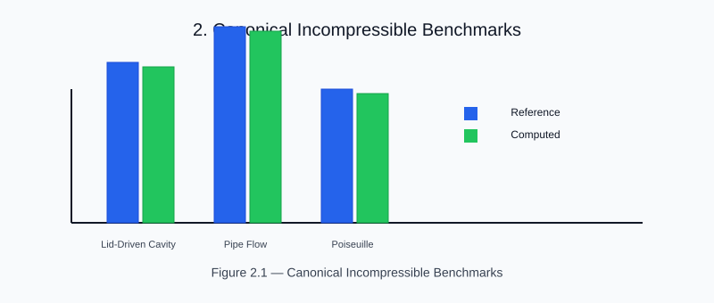

# Chapter 2 — Canonical Incompressible Benchmarks

<!-- generated-figure-start -->

*Figure 2.1 — Canonical Incompressible Benchmarks*
<!-- generated-figure-end -->

These cases establish confidence in solver behavior for standard CFD flows:
lid-driven cavity, internal pipe flow, and turbulent channel references.

They are intended as regression anchors while backend migrations continue.
