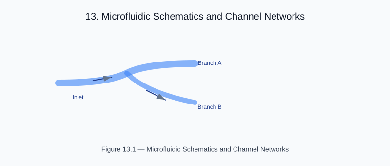

# Chapter 21 — 2-D and Schematic Examples

<!-- generated-figure-start -->

*Figure 13.1 — Microfluidic Schematics and Channel Networks*
<!-- generated-figure-end -->

For a detailed overview of the two-phase design pattern (generation and simulation) and a list of run commands, see [2-D Flows and Schematic Integration](schematic_integration_2d.md).
