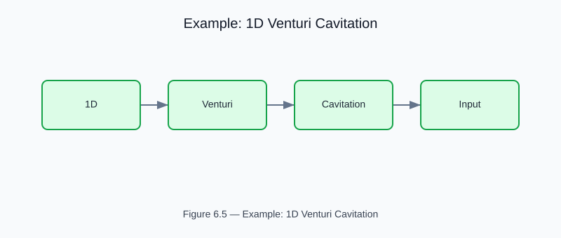

# Example: 1D Venturi Cavitation Screening

<!-- generated-figure-start -->

*Figure 6.5 — Example: 1D Venturi Cavitation*
<!-- generated-figure-end -->

**Crate**: `cfd-suite` (workspace root)
**Run**: `cargo run --example 1d_venturi_cavitation`
**Source**: [`examples/1d_venturi_cavitation.rs`](../../../examples/1d_venturi_cavitation.rs)

## What This Example Demonstrates

1-D Bernoulli + cavitation inception screening for a rectangular Venturi, optionally with selective cell cavitation.

| API | Purpose |
|---|---|
| `cfd_1d::{evaluate_venturi_screening, assess_venturi_screening, VenturiScreeningInput}` | Bernoulli pressure recovery predicts inception |

## Physics Background

Bernoulli pressure recovery predicts inception. Vena contracta coefficient and diffuser recovery factor model real-geometry losses.

## Book Chapter

[← Part III — Turbulence and Multiphase](../turbulence_multiphase.md)
