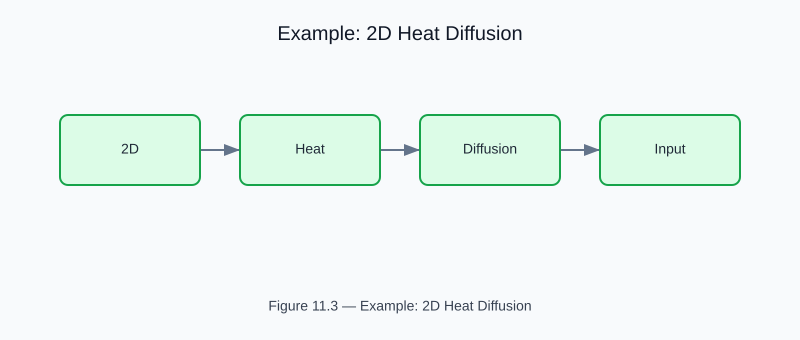

# Example: 2D Heat Diffusion Solver

<!-- generated-figure-start -->

*Figure 11.3 — Example: 2D Heat Diffusion*
<!-- generated-figure-end -->

**Crate**: `cfd-suite` (workspace root)
**Run**: `cargo run --example 2d_heat_diffusion`
**Source**: [`examples/2d_heat_diffusion.rs`](../../../examples/2d_heat_diffusion.rs)

## What This Example Demonstrates

Transient 2D heat equation solved with explicit finite differences on a structured grid.

| API | Purpose |
|---|---|
| `cfd_2d::solvers::heat_diffusion::{HeatDiffusion2D, ThermalConfig}` | ∂T/∂t = α ∇²T |

## Physics Background

∂T/∂t = α ∇²T. Validated by comparing steady-state against analytical solution for constant-source problem.

## Book Chapter

[← Part V — Discretization and Solvers](../numerics_and_solvers.md)
