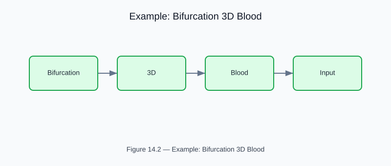

# Example: bifurcation_3d_blood

<!-- generated-figure-start -->

*Figure 14.2 — Example: Bifurcation 3D Blood*
<!-- generated-figure-end -->

**Crate**: `cfd-3d`  **Run**: `cargo run -p cfd-3d --example bifurcation_3d_blood`

Full 3-D simulation of non-Newtonian blood in a symmetric bifurcation.  Reports pressure drop, wall shear stress distribution, and Murray's law compliance.

## Book Chapter
[← 3-D Flows](../crate_3d_flows.md)
