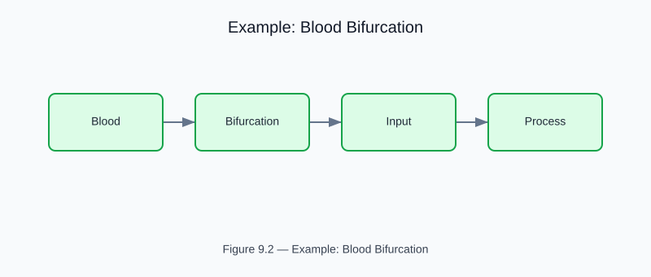

# Example: blood_bifurcation

<!-- generated-figure-start -->

*Figure 9.2 — Example: Blood Bifurcation*
<!-- generated-figure-end -->

**Crate**: `cfd-1d`  **Run**: `cargo run -p cfd-1d --example blood_bifurcation`

Symmetric and asymmetric 1-D arterial bifurcations with Casson and Carreau-Yasuda blood models.  Validates against Murray's law and Hagen-Poiseuille analytical results.

## Book Chapter
[← 1-D Biomedical Flows](../crate_1d_flows.md)
