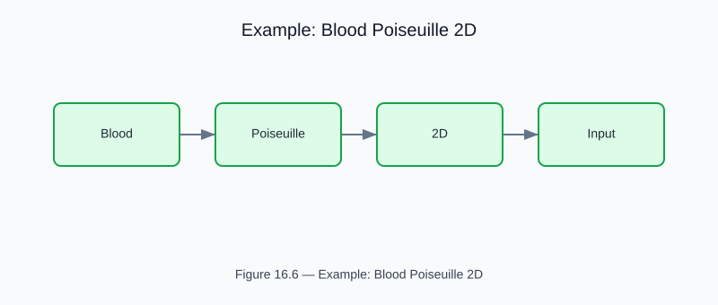

# Example: blood_poiseuille_2d

<!-- generated-figure-start -->

*Figure 16.6 — Example: Blood Poiseuille 2D*
<!-- generated-figure-end -->

**Crate**: `cfd-validation`
**Run**: `cargo run -p cfd-validation --example blood_poiseuille_2d`
**Source**: [`crates/cfd-validation/examples/blood_poiseuille_2d.rs`](../../../crates/cfd-validation/examples/blood_poiseuille_2d.rs)

## What This Example Demonstrates

Steady non-Newtonian Poiseuille flow in a 2D channel (200 µm × 200 µm × 1 mm)
solved with the Casson blood model and compared against the Newtonian
analytical Poiseuille solution for the same pressure gradient.

| Aspect | Reference |
|---|---|
| Velocity profile | Newtonian analytical Poiseuille solution |
| Rheology | CassonBlood::normal_blood (yield stress + infinite-shear viscosity) |
| Geometry | 2D channel, µm scale |
| Comparison | `PoiseuilleFlow2D::analytical_solution(mu_newtonian)` vs numerical |

## Key Code Snippet

```rust
use cfd_2d::solvers::{BloodModel, PoiseuilleConfig, PoiseuilleFlow2D};
use cfd_core::error::Result;
use cfd_core::physics::fluid::blood::CassonBlood;

fn main() -> Result<()> {
    let config = PoiseuilleConfig::<f64> {
        height: 200e-6,
        width: 200e-6,
        length: 1e-3,
        ny: 64,
        pressure_gradient: 500.0,
        tolerance: 1e-8,
        max_iterations: 200,
        ..Default::default()
    };
    let blood = BloodModel::Casson(CassonBlood::normal_blood());
    let mut solver = PoiseuilleFlow2D::new(config, blood);
    let iterations = solver.solve()?;

    // Newtonian reference viscosity: 3.5 mPa·s (canonical whole-blood).
    let analytical = solver.analytical_solution(3.5e-3);
    let profile = solver.velocity_profile();
    let mut err_sq = 0.0;
    let mut norm_sq = 0.0;
    for (u_num, u_ref) in profile.iter().zip(&analytical) {
        err_sq += (u_num - u_ref).powi(2);
        norm_sq += u_ref.powi(2);
    }
    let relative_l2_error = (err_sq / norm_sq).sqrt();

    println!("Converged in {iterations} iterations");
    println!("Numerical peak velocity: {:.6e} m/s", solver.max_velocity());
    println!("Relative L2 error: {relative_l2_error:.4e}");
    Ok(())
}
```

## Physics Background

Under Newtonian rheology the Hagen-Poiseuille solution in a 2D channel yields a
parabolic velocity profile. The Casson model introduces a yield stress via

`√τ = √τ_y + √(μ_∞ · γ̇)`

with `τ_y ≈ 0.0056 Pa` (yield stress at Ht ≈ 45%) and `μ_∞ ≈ 0.00345 Pa·s`
(infinite-shear viscosity). The plug-flow core from the yield stress blunts the
profile relative to the Newtonian parabola, so a non-zero L2 error between
numerical (Casson) and analytical (Newtonian) profiles is expected and confirms
that the solver is faithfully reproducing the non-Newtonian constitutive law.

## Book Chapter

[← Validation Suite](../crate_validation.md)
