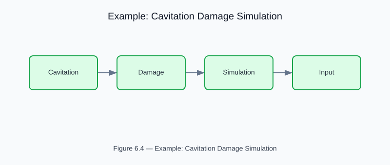

# Example: Cavitation Damage Prediction with Multi-Phase CFD

<!-- generated-figure-start -->

*Figure 6.4 — Example: Cavitation Damage Simulation*
<!-- generated-figure-end -->

**Crate**: `cfd-suite` (workspace root)
**Run**: `cargo run --example cavitation_damage_simulation`
**Source**: [`examples/cavitation_damage_simulation.rs`](../../../examples/cavitation_damage_simulation.rs)

## What This Example Demonstrates

VOF multi-phase simulation with Rayleigh-Plesset bubble dynamics and erosion rate prediction.

| API | Purpose |
|---|---|
| `cfd_core::physics::cavitation::{CavitationModel, ErosionRate}` | Bubble dynamics via Rayleigh-Plesset equation |
| `VOF interface tracking` | Bubble dynamics via Rayleigh-Plesset equation |

## Physics Background

Bubble dynamics via Rayleigh-Plesset equation. Erosion rate from collapse energy. Material damage model with cumulative tracking.

## Book Chapter

[← Part III — Turbulence and Multiphase](../turbulence_multiphase.md)
