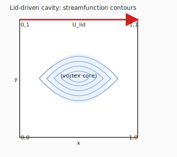

# Example: cavity_validation

**Crate**: `cfd-suite` (workspace root)  
**Run**: `cargo run --example cavity_validation`  
**Source**: [`examples/cavity_validation.rs`](../../../examples/cavity_validation.rs)

## What This Example Demonstrates

Validates the vorticity-stream solver against Ghia, Ghia & Shin (1982) benchmark data
for lid-driven cavity flow at Re = 100.

| Concept | API |
|---|---|
| Unit-square structured grid | `StructuredGrid2D::<f64>::unit_square(nx, ny)` |
| Vorticity-stream configuration | `VorticityStreamConfig::<f64>::default()` |
| Lid-driven boundary conditions | `solver.initialize_lid_driven_cavity(1.0)` |
| Time-marching | `solver.step()` |

## Key Code Snippet

```rust
use cfd_2d::grid::StructuredGrid2D;
use cfd_2d::physics::vorticity_stream::{VorticityStreamConfig, VorticityStreamSolver};

let grid = StructuredGrid2D::<f64>::unit_square(41, 41)?;

let mut config = VorticityStreamConfig::<f64>::default();
config.base.convergence.max_iterations = 10000;
config.base.convergence.tolerance = 1e-6;

let mut solver = VorticityStreamSolver::new(config, &grid, 100.0); // Re = 100
solver.initialize_lid_driven_cavity(1.0)?;

for _ in 0..1000 { solver.step()?; }
```

## Validation Data

The Ghia et al. Re = 100 vertical-centreline u-velocity benchmark points used here:

| y/H | u (ref) |
|-----|---------|
| 1.000 | 1.00000 (lid) |
| 0.953 | 0.68717 |
| 0.500 | −0.20581 (centre) |
| 0.055 | −0.03717 |
| 0.000 | 0.00000 (wall) |

## Generated Figure



## Book Chapter

[← Canonical Incompressible Benchmarks](../core_flows.md)

