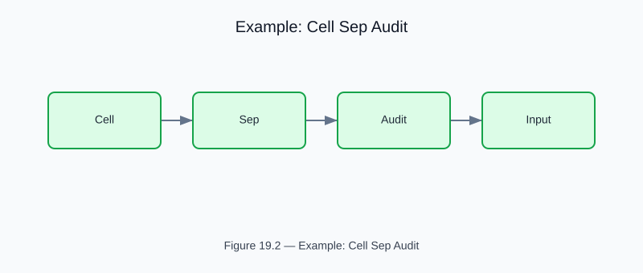

# Example: cell_sep_audit

<!-- generated-figure-start -->

*Figure 19.2 — Example: Cell Sep Audit*
<!-- generated-figure-end -->

**Crate**: `cfd-optim`  **Run**: `cargo run -p cfd-optim --example cell_sep_audit`

Latin-hypercube audit of the cell-separation microfluidic design space.  Uses `tyche-core` LHS sampling to map the Pareto frontier of separation efficiency vs pressure drop.

## Book Chapter
[← Optimization](../crate_optim.md)
