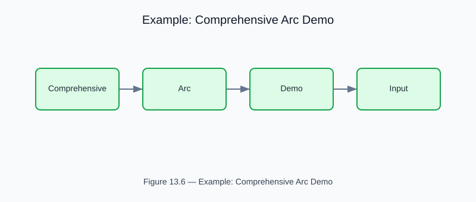

# Example: comprehensive_arc_demo

<!-- generated-figure-start -->

*Figure 13.6 — Example: Comprehensive Arc Demo*
<!-- generated-figure-end -->

**Source**: [`crates/cfd-schematics/examples/arc/comprehensive_arc_demo.rs`](../../../crates/cfd-schematics/examples/arc/comprehensive_arc_demo.rs)
**Crate**: `cfd-schematics`
**Run**: `cargo run -p cfd-schematics --example comprehensive_arc_demo`

Sweeps arc-channel curvature, smoothness, direction, and preset configurations to generate a broad schematic corpus for arc-geometry tuning.

## Part Reference

Part VI — Geometry, Meshing, and CSG
