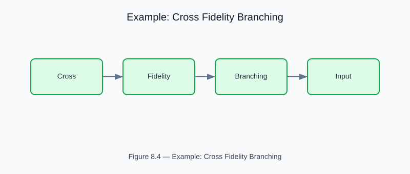

# Example: Cross-Fidelity Branching Validation

<!-- generated-figure-start -->

*Figure 8.4 — Example: Cross Fidelity Branching*
<!-- generated-figure-end -->

**Crate**: `cfd-suite` (workspace root)
**Run**: `cargo run --example cross_fidelity_branching`
**Source**: [`examples/cross_fidelity_branching.rs`](../../../examples/cross_fidelity_branching.rs)

## What This Example Demonstrates

Compares 1-D Hagen-Poiseuille vs 2-D LBM for millifluidic bifurcation and trifurcation blueprints.

| API | Purpose |
|---|---|
| `cfd_schematics::{bifurcation_rect, trifurcation_rect}` | 1-D network model (fast) vs 2-D depth-averaged Lattice Boltzmann (high fidelity) |
| `process_blueprint_with_reference_trace` | 1-D network model (fast) vs 2-D depth-averaged Lattice Boltzmann (high fidelity) |

## Physics Background

1-D network model (fast) vs 2-D depth-averaged Lattice Boltzmann (high fidelity). Validates mass conservation and pressure drop across fidelity levels.

## Book Chapter

[← Part IV — Biomedical and Specialized Flows](../biomedical_flows.md)
