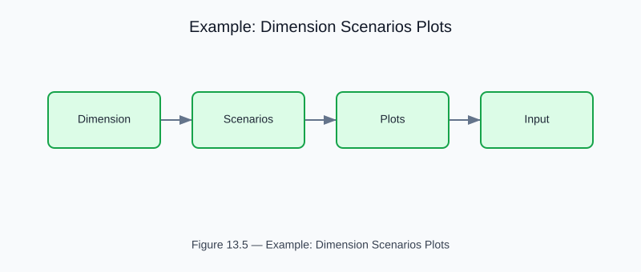

# Example: Dimension Scenarios and Visualization

<!-- generated-figure-start -->

*Figure 13.5 — Example: Dimension Scenarios Plots*
<!-- generated-figure-end -->

**Crate**: `cfd-suite` (workspace root)
**Run**: `cargo run --example dimension_scenarios_plots`
**Source**: [`examples/dimension_scenarios_plots.rs`](../../../examples/dimension_scenarios_plots.rs)

## What This Example Demonstrates

Runs CFD scenarios at multiple spatial dimensions (1D, 2D, 3D) and produces dimensionless analysis plots.

| API | Purpose |
|---|---|
| `cfd_core::physics` | Dimensional analysis via Reynolds, Womersley, and Strouhal numbers |
| `cfd_1d` | Dimensional analysis via Reynolds, Womersley, and Strouhal numbers |
| `cfd_2d` | Dimensional analysis via Reynolds, Womersley, and Strouhal numbers |
| `cfd_3d` | Dimensional analysis via Reynolds, Womersley, and Strouhal numbers |

## Physics Background

Dimensional analysis via Reynolds, Womersley, and Strouhal numbers. Cross-dimensional validation of conservation properties.

## Book Chapter

[← Part VI — Geometry, Meshing, and CSG](../geometry_and_meshing.md)
