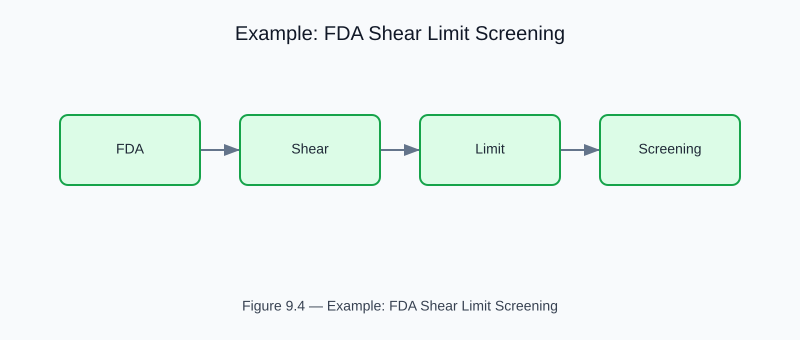

# Example: fda_shear_limit_screening

<!-- generated-figure-start -->

*Figure 9.4 — Example: FDA Shear Limit Screening*
<!-- generated-figure-end -->

**Crate**: `cfd-1d`  **Run**: `cargo run -p cfd-1d --example fda_shear_limit_screening`

Screens device geometries against the FDA haemolysis threshold.  Integrates shear history along streamlines and flags geometries that exceed the NIH haemolysis index.

## Book Chapter
[← 1-D Biomedical Flows](../crate_1d_flows.md)
