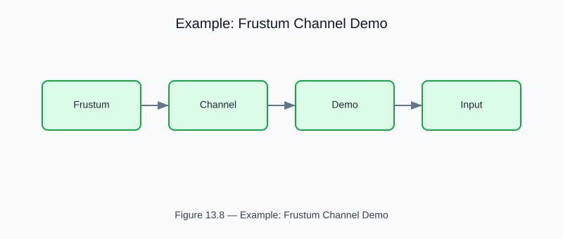

# Example: frustum_channel_demo

<!-- generated-figure-start -->

*Figure 13.8 — Example: Frustum Channel Demo*
<!-- generated-figure-end -->

**Crate**: `cfd-schematics`  **Run** (from crates/cfd-schematics): `cargo run --example venturi/frustum_channel_demo`

Parametric frustum (truncated-cone) Venturi geometry.  Sweeps half-angle and contraction ratio, writes annotated SVG schematics.

## Book Chapter
[← Geometry Schematics](../crate_schematics.md)
