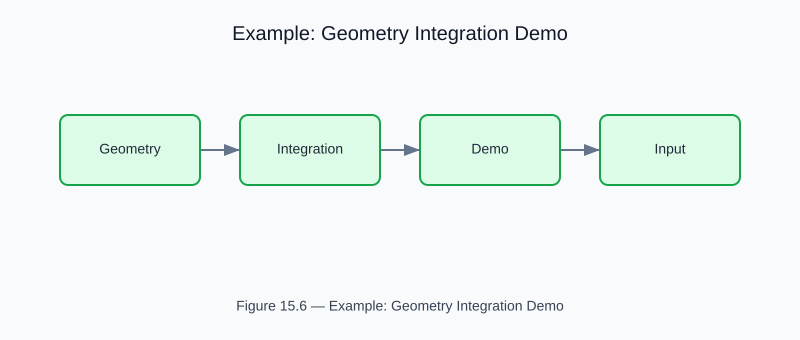

# Example: geometry_integration_demo

<!-- generated-figure-start -->

*Figure 15.6 — Example: Geometry Integration Demo*
<!-- generated-figure-end -->

**Source**: `crates/cfd-1d/examples/geometry_integration_demo.rs`  
**Crate**: `cfd-1d`

## Overview

Full pipeline: generate bifurcation geometry via `cfd-schematics`, convert to `ChannelSpec`/`NodeSpec`, build and solve the 1D network, visualize flow rate distribution, export results to JSON.

## Key API

Uses `AnalysisOverlay` for typed CFD field visualization (no raw `cfd_1d::domain::channel` imports — fully schema-driven).

## Run

```bash
cargo run -p cfd-1d --example geometry_integration_demo
```

## Part Reference

Part VIII — 2-D and Schematic Examples
