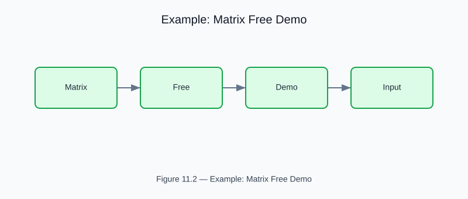

# Example: matrix_free_demo

<!-- generated-figure-start -->

*Figure 11.2 — Example: Matrix Free Demo*
<!-- generated-figure-end -->

**Crate**: `cfd-math`  
**Run**: `cargo run -p cfd-math --example matrix_free_demo`  
**Source**: [`crates/cfd-math/examples/matrix_free_demo.rs`](../../../crates/cfd-math/examples/matrix_free_demo.rs)

## What This Example Demonstrates

Matrix-free CG and Laplacian operator application using the
`csr_math::linear_solver` path, solving a 1D diffusion problem without ever
storing the coefficient matrix beyond its CSR triple.

| API | Purpose |
|---|---|
| `csr_matrix::sparse::SparseMatrixBuilder` | Assembles the SPD tridiagonal 1D Laplacian |
| `csr_matrix::linear_solver::krylov::cg` | Iterative SPD solver |
| `IterativeSolverConfig` | Tolerance, max-iteration, relative-tolerance control |
| `csr_core::SolveReport` | Termination, iteration count, final residual norm |

## Key Code Snippet

```rust,ignore
use cfd_math::linear_solver::{krylov::cg, IterativeSolverConfig};
use cfd_math::sparse::SparseMatrixBuilder;
use leto::Array1;
use leto_ops::CsrMatrix;

let n = 64_usize;
let dx = 1.0 / (n + 1) as f64;
let dx2_inv = 1.0 / (dx * dx);

// 1D diffusion operator (d²u/dx²) with homogeneous Dirichlet BCs.
let mut builder = SparseMatrixBuilder::<f64>::new(n, n);
for i in 0..n {
    builder.add_entry(i, i, 2.0 * dx2_inv)?;
    if i > 0 { builder.add_entry(i, i - 1, -dx2_inv)?; }
    if i + 1 < n { builder.add_entry(i, i + 1, -dx2_inv)?; }
}
let matrix: CsrMatrix<f64> = builder.build()?;

let rhs = Array1::from_elem([n], 1.0_f64);
let mut solution = Array1::<f64>::zeros([n]);
let config = IterativeSolverConfig {
    max_iterations: n * 4,
    tolerance: 1.0e-10,
    relative_tolerance: 1.0e-12,
};
let report = cg(&matrix, &rhs, &mut solution, &config)?;
println!("{} iters, ‖b − A·x‖₂ = {}", report.iterations, report.final_residual_norm);
```

## Why Matrix-Free?

For large structured grids the stencil can be applied in O(N) memory and time
without storing an N×N matrix. The `LinearOperator` trait enables any
operator — spectral, FEM, or finite-difference — to plug into the same CG/GMRES
iterative solver path.

## Book Chapter

[← Spectral, FEM, MUSCL, and Matrix-Free Methods](../numerics_and_solvers.md)
