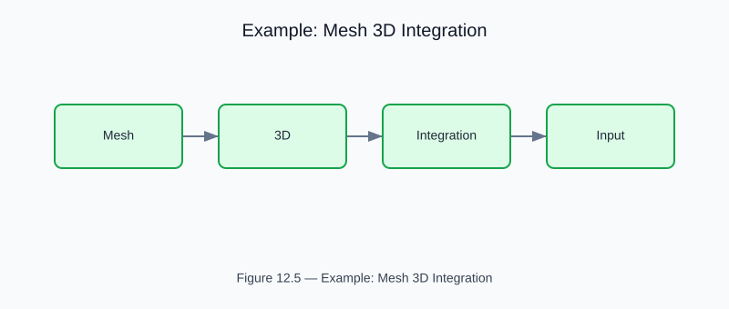

# Example: 3D Mesh Generation and Integration

<!-- generated-figure-start -->

*Figure 12.5 — Example: Mesh 3D Integration*
<!-- generated-figure-end -->

**Crate**: `cfd-suite` (workspace root)
**Run**: `cargo run --example mesh_3d_integration`
**Source**: [`examples/mesh_3d_integration.rs`](../../../examples/mesh_3d_integration.rs)

## What This Example Demonstrates

Builds a 3D tetrahedral mesh from CSG primitives and validates watertightness, Euler characteristic, and volume accuracy.

| API | Purpose |
|---|---|
| `cfd_mesh::{IndexedMesh, AdjacencyGraph}` | Euler characteristic V - E + F = 2 for closed orientable surfaces |
| `BlueprintMeshPipeline` | Euler characteristic V - E + F = 2 for closed orientable surfaces |

## Physics Background

Euler characteristic V - E + F = 2 for closed orientable surfaces. Volume accuracy via signed-volume calculation.

## Book Chapter

[← Part VI — Geometry, Meshing, and CSG](../geometry_and_meshing.md)
