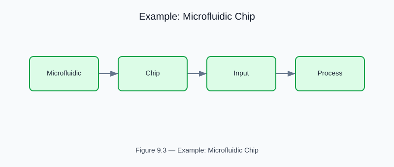

# Example: microfluidic_chip

<!-- generated-figure-start -->

*Figure 9.3 — Example: Microfluidic Chip*
<!-- generated-figure-end -->

**Crate**: `cfd-1d`  **Run**: `cargo run -p cfd-1d --example microfluidic_chip`

Pressure-driven flow through a multi-channel microfluidic chip network.  Computes per-channel flow rates and verifies Kirchhoff current-law conservation.

## Book Chapter
[← 1-D Biomedical Flows](../crate_1d_flows.md)
