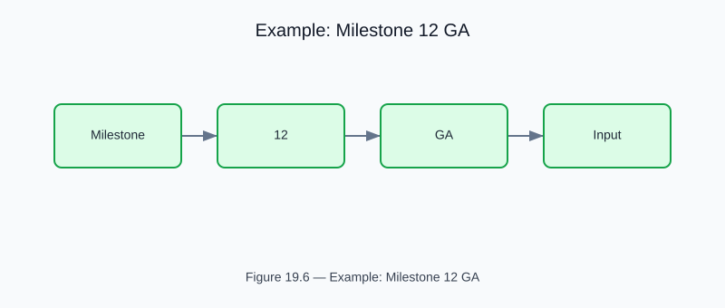

# Example: milestone12_ga

<!-- generated-figure-start -->

*Figure 19.6 — Example: Milestone 12 GA*
<!-- generated-figure-end -->

**Source**: `crates/cfd-optim/examples/milestone12_ga.rs`  
**Crate**: `cfd-optim`

## Overview

Genetic algorithm track for in-place Dean–serpentine refinement of Option 2 venturi designs. Inserts curved serpentine segments to exploit Dean instability.

## Dean Number

```text
De = Re · √(D_h / 2R_c)
```

GA score rewards designs that co-localize Dean vortex focusing with venturi cavitation at bend apices.

## GA Mutations

1. **Branch width scaling** — shifts the Zweifach–Fung flow partition ratio
2. **Serpentine insertion** — adds curved segments for Dean secondary flow
3. **Venturi throat narrowing** (`×0.92`) — lowers σ for cavitation

## Run

```bash
cargo run -p cfd-optim --example milestone12_ga
```

## Part Reference

Part VIII — Optimization
