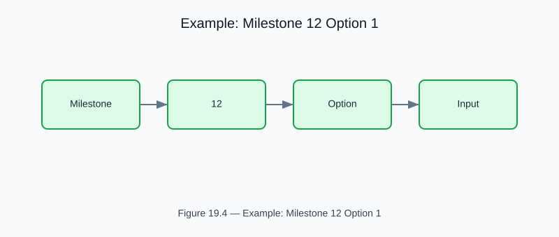

# Example: milestone12_option1

<!-- generated-figure-start -->

*Figure 19.4 — Example: Milestone 12 Option 1*
<!-- generated-figure-end -->

**Source**: `crates/cfd-optim/examples/milestone12_option1.rs`  
**Crate**: `cfd-optim`

## Overview

Selective Acoustic Residence/Separation track. Exploits the **Zweifach–Fung effect** at asymmetric bifurcations to steer CTCs toward the wider center branch via inertial focusing.

## Physics

- Fåhræus–Lindqvist plasma skimming at asymmetric junctions
- Branch-width ratios optimized for `cancer_center_fraction` and residence time `τ_res = L/v̄`
- Acoustic resonance factor: `D_h ≈ λ/2 ≈ 1.87 mm` for 412 kHz standing waves

## Run

```bash
cargo run -p cfd-optim --example milestone12_option1
```text

## Part Reference

Part VIII — Optimization
