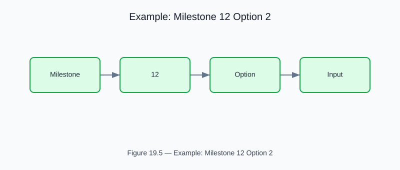

# Example: milestone12_option2

<!-- generated-figure-start -->

*Figure 19.5 — Example: Milestone 12 Option 2*
<!-- generated-figure-end -->

**Source**: `crates/cfd-optim/examples/milestone12_option2.rs`  
**Crate**: `cfd-optim`

## Overview

Selective Venturi Hydrodynamic Cavitation track. Centers on Rayleigh–Plesset bubble dynamics in venturi throat constrictions for sonodynamic therapy.

## Physics

Bernoulli cavitation number:
```text
σ = (p∞ − pᵥ) / (½ρv²)
```
When σ < 1, static pressure drops below vapour pressure (pᵥ ≈ 6.3 kPa at 37 °C), nucleating microbubbles.

## Design Constraints

- Lower bound: throat width ≥ 35 µm (avoid RBC clogging)
- Upper bound: throat width ≤ 120 µm (maintain cavitation at ≤ 250 kPa pump pressure)

## Run

```bash
cargo run -p cfd-optim --example milestone12_option2
```

## Part Reference

Part VIII — Optimization
