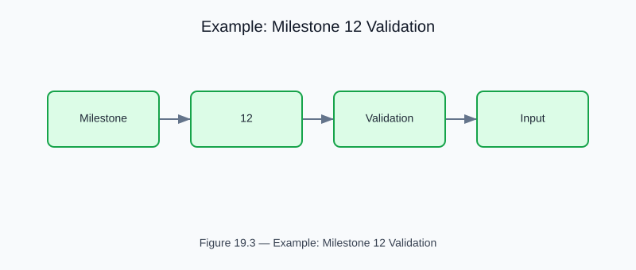

# Example: milestone12_validation

<!-- generated-figure-start -->

*Figure 19.3 — Example: Milestone 12 Validation*
<!-- generated-figure-end -->

**Crate**: `cfd-optim`  **Run**: `cargo run -p cfd-optim --example milestone12_validation`

Full Pareto-front validation for the Milestone 12 geometry: genetic algorithm (`cfd-optim`) vs Latin-hypercube (`tyche-core`) vs random baseline.  Reports convergence metrics and dominated hypervolume.

## Book Chapter
[← Optimization](../crate_optim.md)
