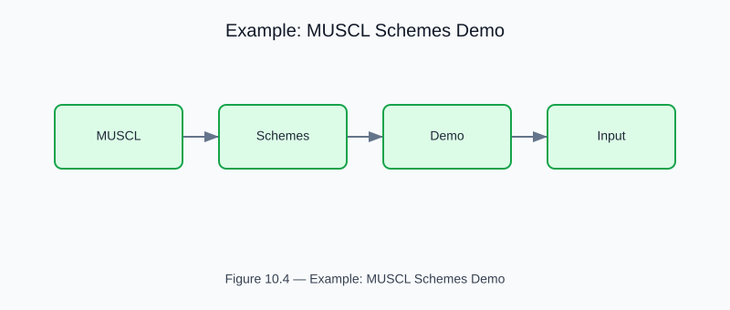

# Example: MUSCL Higher-Order Reconstruction Schemes

<!-- generated-figure-start -->

*Figure 10.4 — Example: MUSCL Schemes Demo*
<!-- generated-figure-end -->

**Crate**: `cfd-suite` (workspace root)
**Run**: `cargo run --example muscl_schemes_demo`
**Source**: [`examples/muscl_schemes_demo.rs`](../../../examples/muscl_schemes_demo.rs)

## What This Example Demonstrates

2nd/3rd-order MUSCL reconstruction with VanLeer, Superbee, and MinMod limiters for shock-capturing.

| API | Purpose |
|---|---|
| `cfd_2d::physics::momentum::{MusclDiscretization, MusclOrder, VanLeer, Superbee}` | MUSCL (Monotonic Upstream-Centered Scheme for Conservation Laws): high-order spatial accuracy with TVD limiters to prevent non-physical oscillations |

## Physics Background

MUSCL (Monotonic Upstream-Centered Scheme for Conservation Laws): high-order spatial accuracy with TVD limiters to prevent non-physical oscillations.

## Book Chapter

[← Part V — Discretization and Solvers](../numerics_and_solvers.md)
