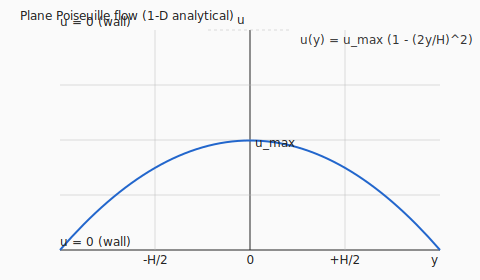
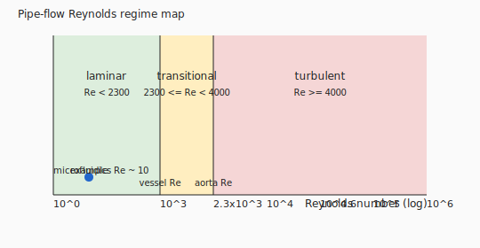

# Example: pipe_flow_validation

**Crate**: `cfd-suite` (workspace root)  
**Run**: `cargo run --example pipe_flow_validation`  
**Source**: [`examples/pipe_flow_validation.rs`](../../../examples/pipe_flow_validation.rs)

## What This Example Demonstrates

Validates a cylindrical-pipe FEM simulation against the analytical
Hagen-Poiseuille solution (Batchelor 1967 §4.2).

| Concept | API |
|---|---|
| Cylindrical pipe mesh | `create_pipe_mesh(R, L, n_circ, n_axial)` |
| Stokes solver | `StokesFlowProblem`, `FemConfig` |
| Parabolic profile validation | Comparison with v_z(r) = −(dp/dz)R²/4μ·(1 − (r/R)²) |

## Key Code Snippet

```rust
use cfd_3d::fem::{StokesFlowProblem, StokesFlowSolution};
use cfd_3d::FemConfig;
use cfd_core::prelude::{BoundaryCondition, ConstantPropertyFluid};

// R = 10 mm, L = 100 mm
let pipe_mesh = create_pipe_mesh(0.01, 0.1, 8, 10)?;
let fluid     = ConstantPropertyFluid::<f64>::water_20c()?;
let problem   = StokesFlowProblem::new(&pipe_mesh, &fluid)?;
let solution  = StokesFlowProblem::solve(&problem, &FemConfig::default())?;
```

## Theorem Validated

**Hagen-Poiseuille** (laminar, fully developed, circular pipe):

```
v_z(r) = −(dp/dz) · R² / (4μ) · (1 − (r/R)²)
Q       = π R⁴ (−dp/dz) / (8μ)
```

The numerical peak velocity at the centreline should match the analytical
value to within the FEM discretisation error.

## Generated Figure




## Book Chapter

[← Canonical Incompressible Benchmarks](../core_flows.md)

