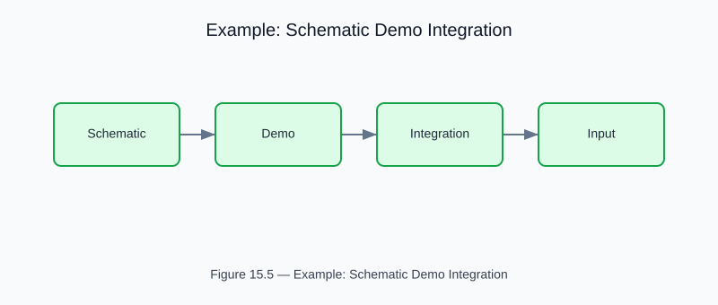

# Example: schematic_demo_integration

<!-- generated-figure-start -->

*Figure 15.5 — Example: Schematic Demo Integration*
<!-- generated-figure-end -->

**Source**: `crates/cfd-1d/examples/schematic_demo_integration.rs`  
**Crate**: `cfd-1d`

## Overview

Demonstrates the integration bridge between `cfd-schematics` and `cfd-1d`: define a network using `NodeSpec`/`ChannelSpec` types, convert to `cfd-1d` simulation objects, then solve.

## Pattern

```rust,ignore
// 1. Define with cfd-schematics types
let blueprint = NetworkBlueprint { nodes, channels };

// 2. Convert to cfd-1d
let (nodes, edges) = convert_blueprint(&blueprint);

// 3. Solve
let problem = NetworkProblem::new(network, config);
let solution = NetworkSolver::solve(problem)?;
```

## Run

```bash
cargo run -p cfd-1d --example schematic_demo_integration
```text

## Part Reference

Part VIII — 2-D and Schematic Examples
