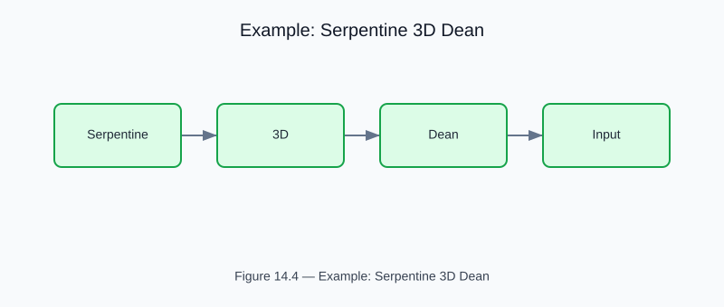

# Example: serpentine_3d_dean

<!-- generated-figure-start -->

*Figure 14.4 — Example: Serpentine 3D Dean*
<!-- generated-figure-end -->

**Crate**: `cfd-3d`  **Run**: `cargo run -p cfd-3d --example serpentine_3d_dean`

Dean-vortex mixing efficiency in a 3-D serpentine channel as a function of Dean number (De).  Validates secondary-flow strength against published correlations.

## Book Chapter
[← 3-D Flows](../crate_3d_flows.md)
