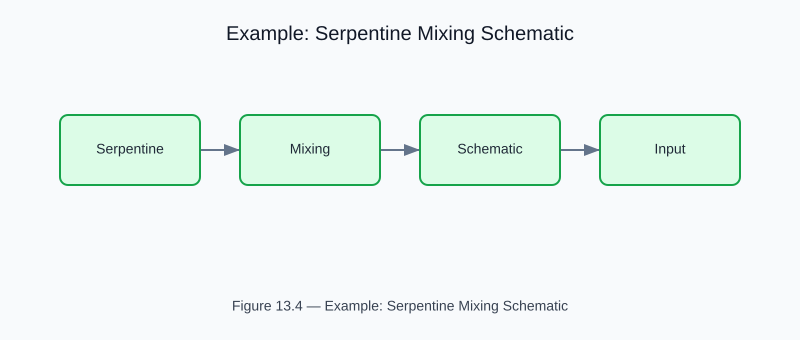

# Example: serpentine_mixing_schematic

<!-- generated-figure-start -->

*Figure 13.4 — Example: Serpentine Mixing Schematic*
<!-- generated-figure-end -->

**Source**: `crates/cfd-2d/examples/serpentine_mixing_schematic.rs`  
**Crate**: `cfd-2d`

## Overview

Schematic visualization of serpentine mixer geometry with flow analysis overlays.

## Run

```bash
cargo run -p cfd-2d --example serpentine_mixing_schematic
```

## Part Reference

Part VIII — 2-D and Schematic Examples
