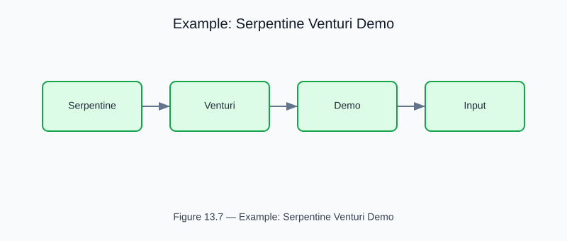

# Example: serpentine_venturi_demo

<!-- generated-figure-start -->

*Figure 13.7 — Example: Serpentine Venturi Demo*
<!-- generated-figure-end -->

**Source**: [`crates/cfd-schematics/examples/venturi/serpentine_venturi_demo.rs`](../../../crates/cfd-schematics/examples/venturi/serpentine_venturi_demo.rs)
**Crate**: `cfd-schematics`
**Run**: `cargo run -p cfd-schematics --example serpentine_venturi_demo`

Demonstrates Dean-apex venturi placement along serpentine bends and emits annotated schematics across multiple segment and throat configurations.

## Part Reference

Part VI — Geometry, Meshing, and CSG
