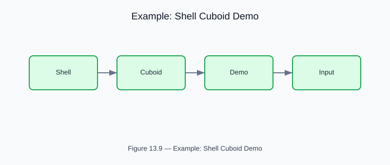

# Example: shell_cuboid_demo

<!-- generated-figure-start -->

*Figure 13.9 — Example: Shell Cuboid Demo*
<!-- generated-figure-end -->

**Source**: [`crates/cfd-schematics/examples/advanced/shell_cuboid_demo.rs`](../../../crates/cfd-schematics/examples/advanced/shell_cuboid_demo.rs)
**Crate**: `cfd-schematics`
**Run**: `cargo run -p cfd-schematics --example shell_cuboid_demo`

Builds a TPMS-filled shell cuboid on a 96-well footprint, renders SVG output, and emits interchange JSON for downstream mesh/CFD workflows.

## Part Reference

Part VI — Geometry, Meshing, and CSG
