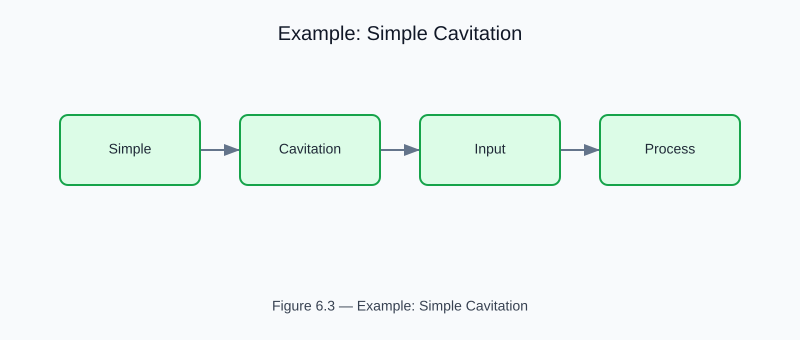

# Example: Simple Cavitation Model

<!-- generated-figure-start -->

*Figure 6.3 — Example: Simple Cavitation*
<!-- generated-figure-end -->

**Crate**: `cfd-suite` (workspace root)
**Run**: `cargo run --example simple_cavitation`
**Source**: [`examples/simple_cavitation.rs`](../../../examples/simple_cavitation.rs)

## What This Example Demonstrates

Minimal cavitation inception and pressure recovery workflow on a constricted channel.

| API | Purpose |
|---|---|
| `cfd_core::physics::cavitation` | Cavitation number σ = 2(p - pv) / ρU² |
| `VenturiScreeningInput` | Cavitation number σ = 2(p - pv) / ρU² |
| `evaluate_venturi_screening` | Cavitation number σ = 2(p - pv) / ρU² |

## Physics Background

Cavitation number σ = 2(p - pv) / ρU². Pressure recovery from inception through collapse.

## Book Chapter

[← Part III — Turbulence and Multiphase](../turbulence_multiphase.md)
