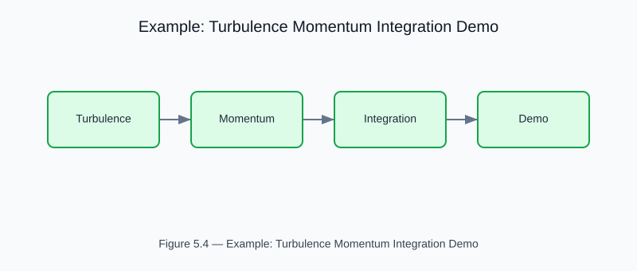

# Example: Turbulence-Momentum Integration

<!-- generated-figure-start -->

*Figure 5.4 — Example: Turbulence Momentum Integration Demo*
<!-- generated-figure-end -->

**Crate**: `cfd-suite` (workspace root)
**Run**: `cargo run --example turbulence_momentum_integration_demo`
**Source**: [`examples/turbulence_momentum_integration_demo.rs`](../../../examples/turbulence_momentum_integration_demo.rs)

## What This Example Demonstrates

Demonstrates coupling between turbulence models and momentum equation in a fully developed channel flow.

| API | Purpose |
|---|---|
| `cfd_2d::physics::turbulence` | Eddy viscosity coupling in the Navier-Stokes momentum equation |
| `cfd_2d::solvers::ns_fvm` | Eddy viscosity coupling in the Navier-Stokes momentum equation |

## Physics Background

Eddy viscosity coupling in the Navier-Stokes momentum equation. Validated against DNS reference data for turbulent channel flow at Re_τ = 395.

## Book Chapter

[← Part III — Turbulence and Multiphase](../turbulence_multiphase.md)
