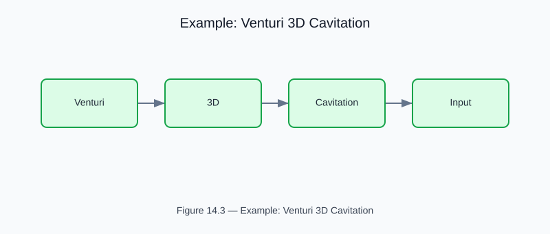

# Example: venturi_3d_cavitation

<!-- generated-figure-start -->

*Figure 14.3 — Example: Venturi 3D Cavitation*
<!-- generated-figure-end -->

**Crate**: `cfd-3d`  **Run**: `cargo run -p cfd-3d --example venturi_3d_cavitation`

3-D Venturi cavitation inception study.  Tracks cavitation number σ vs throat velocity and reports cavitation-damage potential index.

## Book Chapter
[← 3-D Flows](../crate_3d_flows.md)
