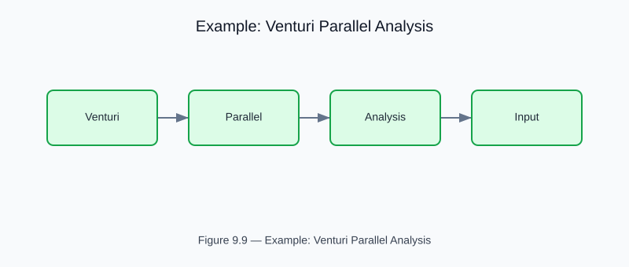

# Example: venturi_parallel_analysis

<!-- generated-figure-start -->

*Figure 9.9 — Example: Venturi Parallel Analysis*
<!-- generated-figure-end -->

**Crate**: `cfd-1d`  **Run**: `cargo run -p cfd-1d --example venturi_parallel_analysis`

Parametric sweep of parallel Venturi network configurations.  Maps pressure drop vs flow-rate curves and identifies optimal aspect ratio for minimal haemolytic shear.

## Book Chapter
[← 1-D Biomedical Flows](../crate_1d_flows.md)
