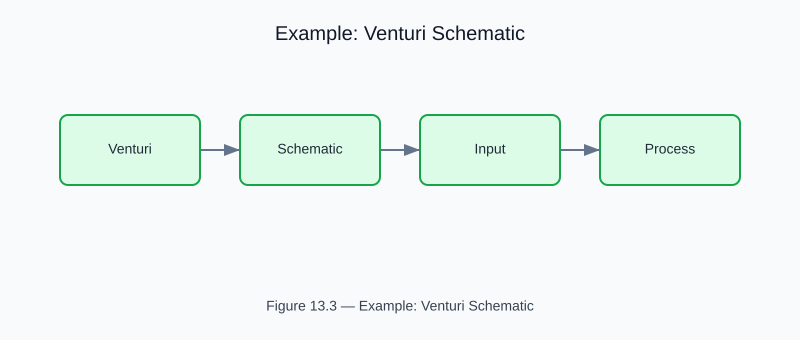

# Example: venturi_schematic

<!-- generated-figure-start -->

*Figure 13.3 — Example: Venturi Schematic*
<!-- generated-figure-end -->

**Source**: `crates/cfd-2d/examples/venturi_schematic.rs`  
**Crate**: `cfd-2d`

## Overview

Two-phase schematic-driven Venturi simulation: design with `cfd-schematics`, simulate with `cfd-2d`.

## Phase 1 — Design

- Venturi topology as `NetworkBlueprint` (5 nodes, 4 channels)
- Renders schematic PNG → `outputs/venturi_schematic.png`

## Phase 2 — Simulation

- `VenturiSolver2D` (ISO 5167, Newtonian blood, 60×30 grid)
- Maps pressure results to `AnalysisOverlay` (BlueRed colormap)
- Renders pressure overlay → `outputs/venturi_pressure_overlay.png`

## Run

```bash
cargo run -p cfd-2d --example venturi_schematic
```text

## Part Reference

Part VIII — 2-D and Schematic Examples
