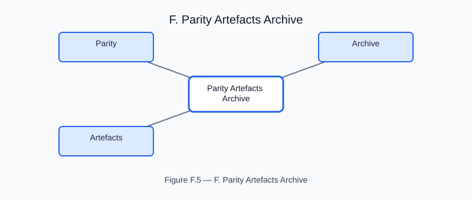

# Parity Artefacts Archive

<!-- generated-figure-start -->

*Figure F.5 — F. Parity Artefacts Archive*
<!-- generated-figure-end -->

The canonical CI gate evidence archive lives in the `parity_artefacts/`
directory at the workspace root.  This page is preserved as a redirect stub for
any historical backlinks.
