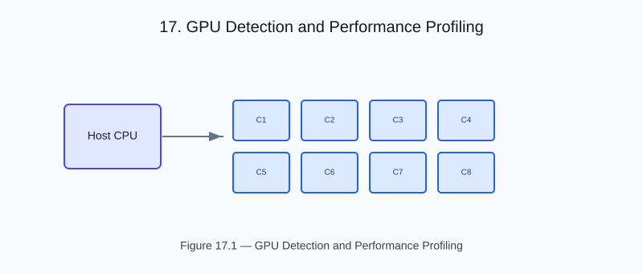

# Chapter 17 — GPU Detection and Performance Profiling

<!-- generated-figure-start -->

*Figure 17.1 — GPU Detection and Performance Profiling*
<!-- generated-figure-end -->

CFDrs builds on the Atlas stack: purpose-built crates sharing one trait
frontier ([`eunomia::RealField`]) and one set of zero-cost abstractions.
This chapter states the performance contract those crates are held to,
maps which crate owns which layer, and points at the runnable
benchmarks that measure it.

## Performance Mandate

Atlas is held to a strict performance contract:

- **Zero heap allocations on hot paths.** All transient storage lives in
  [`mnemosyne::Arena`] sub-arenas.
- **Zero virtual dispatch on numeric kernels.** Trait specialization
  through [`eunomia`] gives the compiler monomorphized code per
  scalar type and backend.
- **Zero copy for read-only views.** [`Cow`] over [`leto::NdArray`]
  eliminates `clone()` calls in adjoint passes.
- **Zero abstraction tax.** Const generics, ZSTs, and GATs encode
  capability and lifetime variance at the type level — there is no
  runtime machinery to charge.

A claim against any of these is settled by measurement, not assertion:
the examples below carry the benchmarks, and a regression in them is a
defect in the solver path rather than a budget to raise.

## Atlas Crate Layers

| Layer | Crate(s) | CFDrs consumer |
|---|---|---|
| Numeric traits | `eunomia::RealField` | every type |
| Dense/sparse storage | `leto::NdArray`, `leto::CsrMatrix`, `leto::DMatrix` | `cfd-math`, `cfd-1d`, `cfd-2d`, `cfd-3d` |
| Geometry | `leto::Point3`, `Vector3`, `Isometry3` | `cfd-schematics`, `cfd-3d` |
| SIMD | `hermes-simd` lanes | `cfd-2d::stencil`, `cfd-3d::fem`, `cfd-1d::kernel` |
| Memory | `mnemosyne::Arena`, `themis::Placement` | every crate |
| Concurrency | `moirai::Executor`, task graph | `cfd-2d::parallel`, `cfd-3d::parallel` |
| FFT | `apollo::FftPlan` | `cfd-3d::spectral`, `cfd-2d::spectral` |
| Tiling | `leto` GAT-based `TileStreaming` | `cfd-3d::stencil`, `cfd-2d::stencil` |

(Tensors, autodiff, GPU backends, and image I/O — included in the full
Atlas stack — are used by `helios` and `kwavers` but not by CFDrs; see
[Atlas Dependency Map](appendix_dependencies.md) for surface compatibility.)

## Examples Referenced by This Chapter

- [`simd_performance_benchmark`](examples/simd_performance_benchmark.md) —
  Hermes SIMD versus scalar stencil benchmarks.
- [`gpu_detection`](examples/gpu_detection.md) — Atlas GPU detection
  (the seam through which CFDrs reaches `hephaestus` once that is wired
  for CFD solvers).
- [`spectral_performance`](examples/spectral_performance.md) —
  Apollo FFT throughput.
- [`venturi_validated`](examples/venturi_validated.md) — venturi case
  validated against the reference venturi phantom.

## Further Reading

- [Atlas Dependency Map](appendix_dependencies.md)
- [`BOOK_ORGANIZATION.md`](BOOK_ORGANIZATION.md) — forward roadmap
