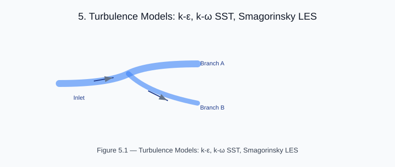

# Chapter 3 — Turbulence Models and Cavitation

<!-- generated-figure-start -->

*Figure 5.1 — Turbulence Models: k-ε, k-ω SST, Smagorinsky LES*
<!-- generated-figure-end -->

CFDrs models three coupled physical regimes: **turbulence** (RANS / LES
closures), **multiphase flows** (phases with distinct equations of state),
and **cavitation** (liquid–vapour phase transition at low pressure).
This chapter documents the integration contracts used to combine them.

## Turbulence Closures

`cfd-3d` integrates the canonical closures through a single trait:

```rust
pub trait TurbulenceModel<T: NumericElement> {
    fn turbulent_viscosity(
        &self,
        flow: &FlowField<T>,
    ) -> Vec<KinematicViscosity<T>>;
    fn turbulent_kinetic_energy(
        &self,
        flow: &FlowField<T>,
    ) -> Vec<SpecificEnergy<T>>;
}
```

The public results retain their physical dimensions through Aequitas:
turbulent viscosity is `m²/s` and turbulent kinetic energy is `J/kg`.
Canonical closures store their dense solver state in the existing scalar
arrays, then wrap values at the public metric boundary. Formula kernels and
dense-field assertions explicitly extract the base scalar. This preserves
Eunomia's real-valued turbulence contract; a complex value is appropriate for
a genuine phasor or Fourier field, not for a real turbulence metric, so no
imaginary physical unit is introduced.

CFDrs distributes three models:

| Model | Crate | Trait impl |
|---|---|---|
| Standard k-ε | `cfd-3d` | `KEpsilon` |
| k-ω SST | `cfd-3d` | `KOmegaSST` |
| Smagorinsky LES | `cfd-3d` | `Smagorinsky` |

The closure returns a **turbulent viscosity** `ν_t` per cell that the
momentum solver applies as an additional diffusion term.

## Multiphase Coupling

For multiphase (e.g. liquid + gas), CFDrs uses a **volume-of-fluid**
style coupling: each cell carries a phase-volume fraction `α ∈ [0, 1]`,
and mixture properties are computed by a weighted sum:

```rust
let rho_mix = rho_l * (1.0 - alpha) + rho_g * alpha;
let mu_mix  = mu_l  * (1.0 - alpha) + mu_g  * alpha;
```

The `MomentumCoupling` enum selects between *co-located* and *staggered*
schemes; SSE-style momentum exchange is supported through
[`cfd_3d::multiphase::exchange`].

## Cavitation Physics

For details on phase transition models, Rayleigh–Plesset closures, and damage integration, see [Cavitation: Liquid-Vapour Phase Transition](cavitation.md).

## Integration Contract

All three regimes compose through the same `Integrate` trait:

```rust
pub trait Integrate {
    fn step<F: FloatElement>(&mut self) -> Result<(), CfdError>;
}
```

The implementation multiplexes the closure choice at the cavity-call site.
This makes regime switching a configuration-change, not a code rewrite.

## Examples Referenced by This Chapter

Part III opens with seven example chapters:

- [`turbulence_models_demo`](examples/turbulence_models_demo.md) — three
  closures compared on a turbulent channel.
- [`turbulence_validation_demo`](examples/turbulence_validation_demo.md) —
  closure against DNS reference data.
- [`turbulence_momentum_integration_demo`](examples/turbulence_momentum_integration_demo.md)
  — closure-integrated momentum solve.
- [`venturi_cavitation`](examples/venturi_cavitation.md) — venturi cavitation
  inception and collapse.
- [`simple_cavitation`](examples/simple_cavitation.md) — single-bubble
  Rayleigh–Plesset in a constrained channel.
- [`cavitation_damage_simulation`](examples/cavitation_damage_simulation.md)
  — long-time damage integration under turbulent inflow.
- [`1d_venturi_cavitation`](examples/1d_venturi_cavitation.md) — 1-D
  reduced cavitation model.

## Further Reading

- [`cfd-3d` turbulence module](../../crates/cfd-3d/src/physics/turbulence/mod.rs)
- [`cfd-3d` multiphase module](../../crates/cfd-3d/src/multiphase.rs)
- [`cfd-3d` cavitation module](../../crates/cfd-3d/src/cavitation.rs)
- [Geometry, Meshing, and CSG](geometry_and_meshing.md) — CSG primitives
  feeding the cavitation geometry.
